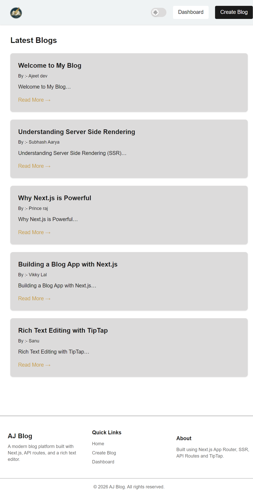
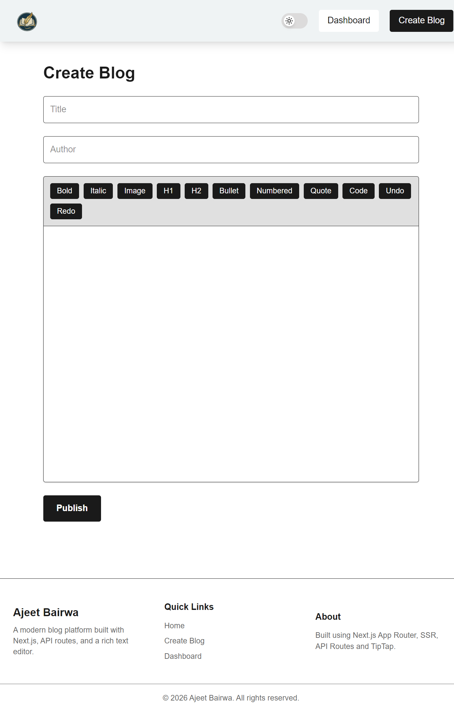
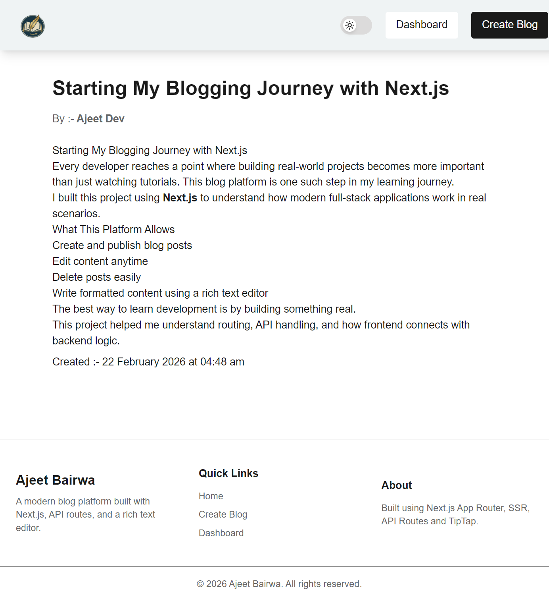

# 📝 Blog Web App


---

## 🚀 Live Link

🔗 https://blog-webapp-mu-eight.vercel.app/

---

## 📌 Project Overview

AJ Blog is a modern full-stack blog application built using **Next.js**.  
It allows users to create, edit, delete, and read blog posts with a rich text editor.

This project demonstrates:

- Clean UI structure  
- Dynamic routing  
- CRUD functionality  
- API integration  
- Component-based architecture  
- Deployment workflow  

It is designed as a portfolio-ready project for internships and frontend/full-stack roles.

---

## ✨ Key Features

- 📰 Display latest blog posts on homepage  
- ✍️ Create new blog posts  
- 🛠️ Edit & delete functionality  
- 🧠 Rich Text Editor (TipTap integration)  
- 🔄 Dynamic routing for blog detail pages  
- ⚡ Optimized performance with Next.js  
- 🌐 Deployed on Vercel  

---

## 🛠️ Tech Stack

**Frontend:** Next.js (React)  
**Backend:** Next.js API Routes  
**Editor:** TipTap Rich Text Editor  
**Styling:** Tailwind CSS  
**Deployment:** Vercel  

---

## 📸 Screenshots


### 🏠 Homepage


### ✍️ Create Blog


### 📄 Blog Details Page


---

## 📦 Installation & Setup

Clone the repository:

```bash
git clone https://github.com/ajitdevv/blog-webapp
cd blog-webapp
npm install
npm run dev
Open in browser: http://localhost:3000


📦 blog-webapp
 ┣ 📂src
 ┣ 📂 app 
 ┃  ┣ 📂 api / blogs
 ┃  ┃  ┗ 📜 route.js
 ┃  ┣ 📂 blog / [id]
 ┃  ┃  ┗ 📜 page.js
 ┃  ┣ 📜 create
 ┃  ┃  ┗ 📜 page.js
 ┃  ┣ 📜 dashboard
 ┃  ┃  ┗ 📜 page.js  
 ┃  ┣ 📜 edit/[id]
 ┃  ┃  ┗ 📜 page.js
 ┃  ┣ 📜 globals.css
 ┃  ┣ 📜 layout.js
 ┃  ┗ 📜 page.js
 ┣ 📂 components
 ┃  ┣ 📜 Footer.jsx
 ┃  ┣ 📜 Hader.jsx
 ┃  ┣ 📜 RichTexteditor.jsx
 ┃  ┗ 📜 ThemeToggle.jsx
 ┣ 📜 package.json
 ┣ 📜 README.md


This project showcases:

-Strong understanding of React fundamentals

-Next.js routing & API handling

-Modular component structure

-Real-world CRUD operations

-Deployment knowledge using Vercel

-Clean and maintainable code structure


👨‍💻 Author

Ajeet Bairwa
Aspiring Full Stack Developer 🚀

GitHub: https://github.com/ajitdevv
